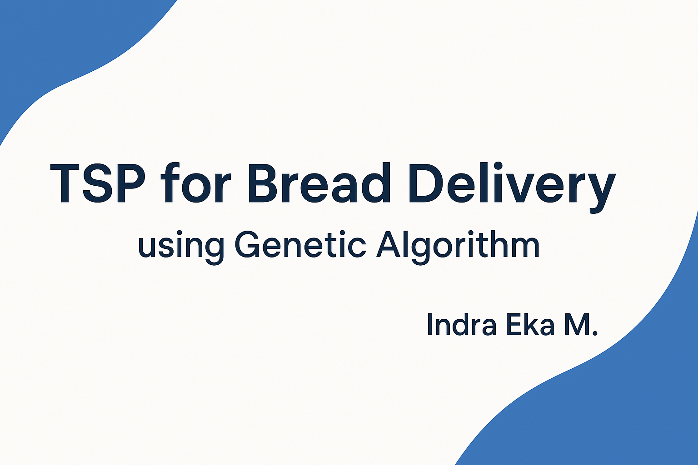

# 🍞 Bread Delivery Route Optimization (TSP) using Genetic Algorithm (MATLAB)

This project solves a **Travelling Salesman Problem (TSP)** for optimizing **bread delivery routes** from a central vendor to multiple stores and back using a **Genetic Algorithm (GA)** in **MATLAB R2020**.

---

---

## 🎯 Objective

- Find the shortest possible route for a delivery vehicle
- Start from a vendor, visit all bread stores once, and return
- Minimize total travel distance based on a given distance matrix

---

## 📊 Input

- Distance matrix between each store and the vendor
- Number of stores

## 📈 Output

- Optimal visiting sequence
- Route visualization
- Total distance cost of the optimized route

---

## 🚀 How to Run

1. Open the project in **MATLAB R2020**
2. Run `Algen_v1.m`
3. Input the distance matrix or use the predefined sample
4. The GA will search for the optimal delivery route

---

## 👨‍💻 Author

**Indra Eka Mandriana S.Kom**  
_Supply Chain Optimization & AI Researcher_

---

## ⭐ Found it helpful? Give it a ⭐
